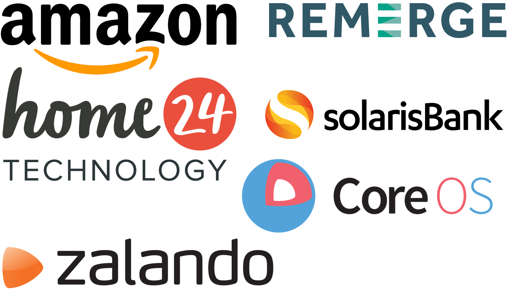

---?image=assets/gopher-berlin-trans.png&size=auto 90%
# GDG Golang Berlin

---?image=assets/gopher-trans.png&size=auto 90%

## What is Go?

- Progamming language developed by Google, published November 2009 |
- It uses safe pointers (without pointer arithmetic) |
- It has garbage collection |
- Simple syntax between C and Java with some simple extensions |

---?image=assets/gopher-brown-trans.png&size=auto 90%

## Why Go?

- Single static binary as result |
- Java developers strive for a 10 minute build; Go developers get angry about a 10 second build |
- Garbage collection blocks for less than 1 ms |
- Builtin concurrency handling (Goroutines) |
- Go is free of magic |
- Everybody strives for simplicity |

---?image=assets/gopher-pilot-trans.png&size=auto 90%

## What is Go used for?

- Cloud technology (Docker, Kubernetes, Prometheus, ...) |
- Advertisement technology (Adjust, Remerge, ...) |
- FinTech (solarisBank, Barzahlen, Fraugster, OptioPay, ...) |
- ??? |
- Mostly used by startups but enterprises are coming |

---?image=assets/gopher-berlin-trans.png&size=auto 90%

# 1351 Members

---?image=assets/friendly-gophers.jpeg&size=contain

Note:
Around 70 attendees

---?image=assets/onefootball-gophers.jpeg&size=contain
Note:
Different hosting companies

---?image=assets/amazon-gophers.jpeg&size=contain

---?image=assets/optiopay-venue.jpeg&size=contain
---?image=assets/optiopay-view.jpeg&size=contain

---?image=assets/kinvolk-gophers.jpeg&size=contain

---?image=assets/new-adjust-gophers.jpeg&size=contain

---?image=assets/google-gophers1.jpeg&size=contain
---?image=assets/google-gophers2.jpeg&size=contain

---?image=assets/chating-gophers.jpeg&size=contain
Note:
Get to know some gophers.

---?image=assets/beer-gophers.jpeg&size=contain
---?image=assets/pizza-gophers.jpeg&size=contain

---?image=assets/gopher-talk1-trans.png&size=contain

## First Talk

- GopherCon Recap! |
- What 'happens before' means to a compiler |
- A fast multi-threaded queue implementation in Go |
- Utilizing (Linux-) eBPF from Go |
- Consumer-Driven Contract Testing |
- Go away: HTTP load shedding |
- Or PowerPoint karaoke for a Go release party |

---

## Hire/Get Hired Section

---?image=assets/chating-gophers2.jpeg&size=contain
Note:
Break: Get to know your future employer.

---?image=assets/beer-gophers.jpeg&size=contain
---?image=assets/pizza-gophers.jpeg&size=contain

---?image=assets/gopher-talk2-trans.png&size=contain

## Second Talk

- Go @ hosting company |
- Parsing Go in Go, for Fun and Profit |
- Making Code Write Itself: How To Build Code Generation Tools in Go |
- From ORM to LEFT OUTER JOIN - how we grew with Go |
- Grand Treatise of Modern Instrumentation and Orchestration - the extended version |
- Or fishbowl session |

---?image=assets/chating-gophers.jpeg&size=contain
Note:
End: Make some friends.

---?image=assets/beer-gophers.jpeg&size=contain
---?image=assets/pizza-gophers.jpeg&size=contain

---?image=assets/cute-gophers.jpeg&size=contain

Note:
Friendly people

---?image=assets/meetup-trans.png&size=contain

## Meetup (GDG Golang Berlin)

[www.meetup.com/golang-users-berlin](https://www.meetup.com/golang-users-berlin)

